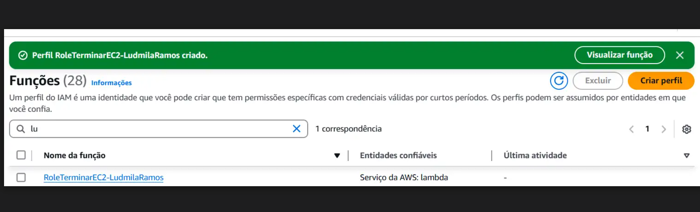
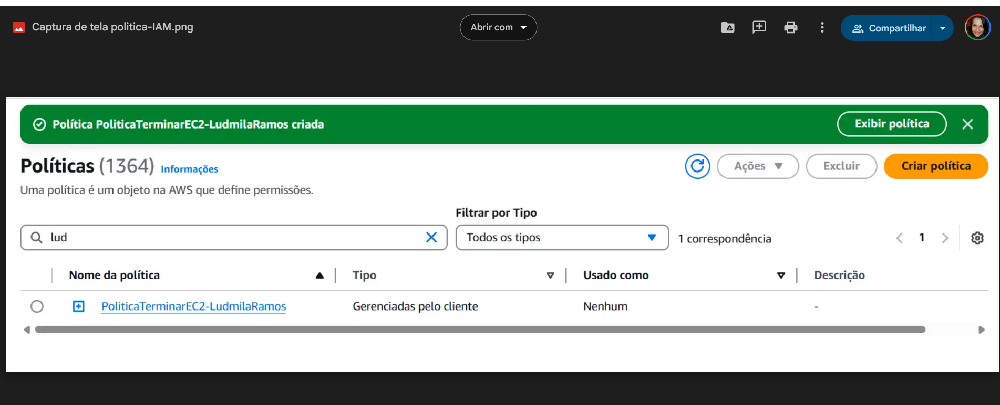

# Lab 3 - Políticas IAM e Função Lambda com EventBridge

Neste laboratório, aprendi a criar e gerenciar políticas IAM e funções Lambda na AWS, com foco em automação e integração entre serviços.

Foi criado um fluxo onde uma função Lambda em Python, associada a uma política IAM específica, pode terminar instâncias EC2 automaticamente, disparada por um evento configurado no EventBridge.

## O que foi feito

- Criação de uma política IAM que permite encerrar instâncias EC2.
- Desenvolvimento de uma função Lambda em Python para executar essa ação.
- Associação da política à função Lambda.
- Configuração do gatilho via EventBridge para execução automática da função.
- Registro visual com prints das políticas, função Lambda e IAM.

---

# 🖼️ Prints do Laboratório

