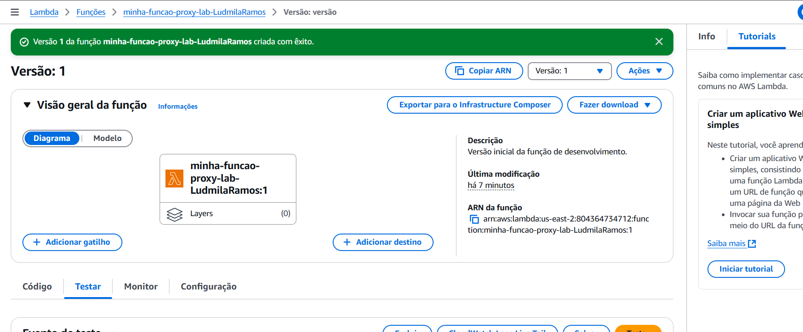
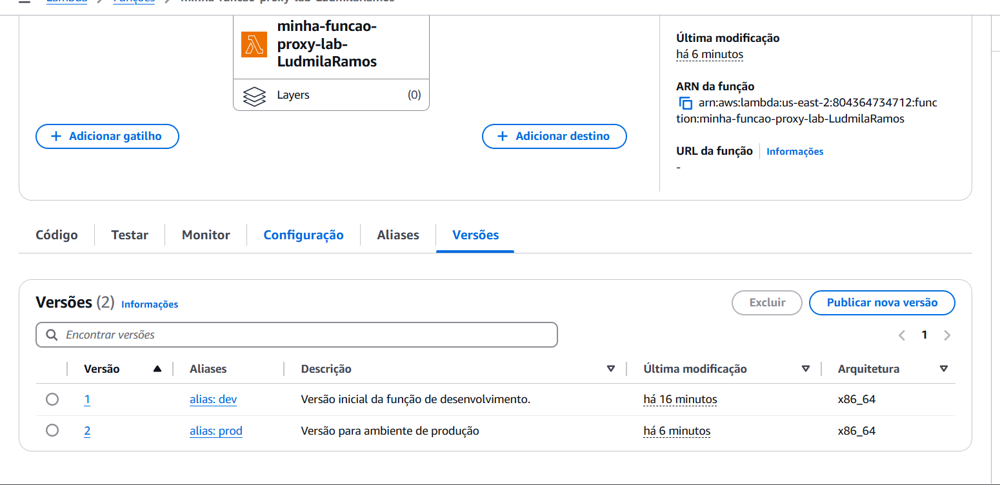
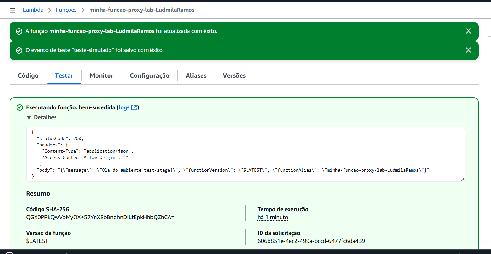
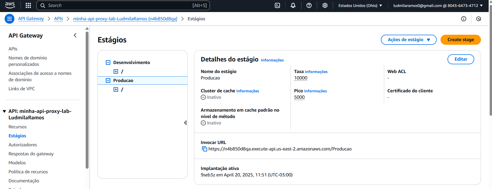
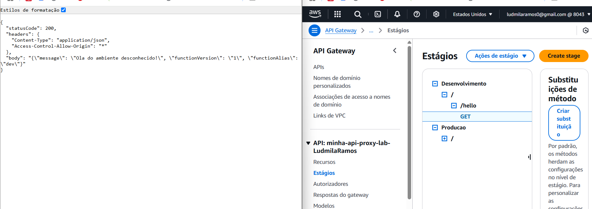
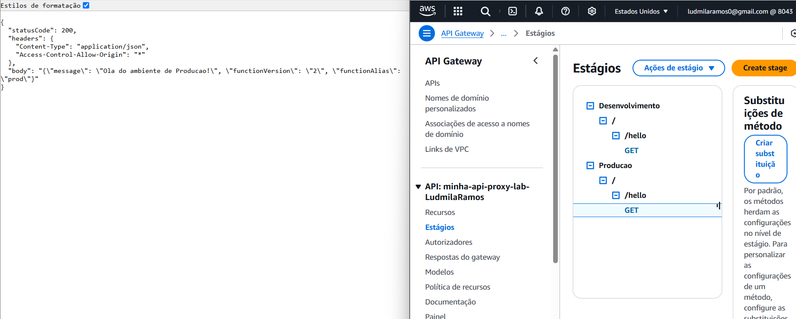
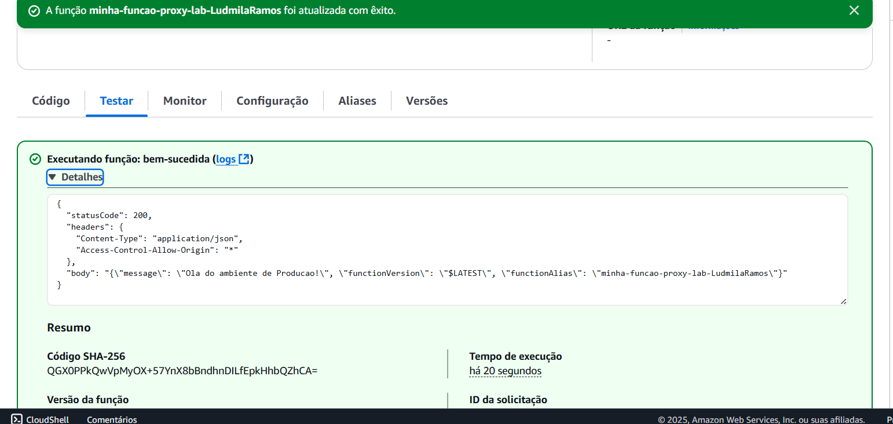

# Lab 6 - AWS Lambda com Aliases e API Gateway com Stages

Neste laboratório, aprendi a configurar uma arquitetura serverless organizada por ambientes (como desenvolvimento e produção), utilizando **Aliases no Lambda** e **Stages no API Gateway**.  
Essa abordagem permite controlar o ciclo de vida da aplicação com segurança e agilidade.

## Objetivos

- Criar uma função AWS Lambda compatível com a integração Proxy do API Gateway.
- Publicar diferentes versões da função Lambda para representar estados distintos do código.
- Criar Aliases no Lambda (ex: `dev`, `prod`) como ponteiros para versões específicas da função.
- Criar uma API REST no API Gateway.
- Configurar a integração do tipo Proxy entre a API Gateway e a função Lambda.
- Criar Stages no API Gateway (ex: `Desenvolvimento`, `Producao`) para representar diferentes ambientes.
- Integrar cada Stage com o Alias correspondente da função Lambda.
- Testar os endpoints de cada Stage (`/dev`, `/prod`) para garantir que acionem a versão correta da função Lambda.
- Compreender os benefícios do uso combinado de Aliases (Lambda) e Stages (API Gateway) para o gerenciamento do ciclo de vida e implantação controlada de aplicações serverless.

## O que foi feito

- Função AWS Lambda criada com integração Proxy com o API Gateway.
- Publicadas múltiplas versões da função Lambda com código diferenciado.
- Aliases `dev` e `prod` configurados no Lambda, apontando para versões específicas.
- API REST criada e configurada no API Gateway com integração Proxy.
- Stages `Desenvolvimento` e `Producao` criados e integrados corretamente com os respectivos Aliases da função Lambda.
- Testes realizados nos endpoints para garantir o comportamento esperado em cada ambiente.

## 🖼️ Prints do Laboratório
## 🖼️ Prints do Laboratório

### Lambda

- 
- 
- 

### API Gateway

- 

### Testes nos endpoints

- 
- 
- 

## Aprendizados e Desafios

Neste laboratório, aprofundei meu entendimento sobre o **gerenciamento de versões e ambientes em arquiteturas serverless**.  
Aprendi como os **Aliases do Lambda** e os **Stages do API Gateway** trabalham juntos para permitir um fluxo de desenvolvimento e implantação mais seguro e controlado, sem a necessidade de replicar APIs ou funções.
