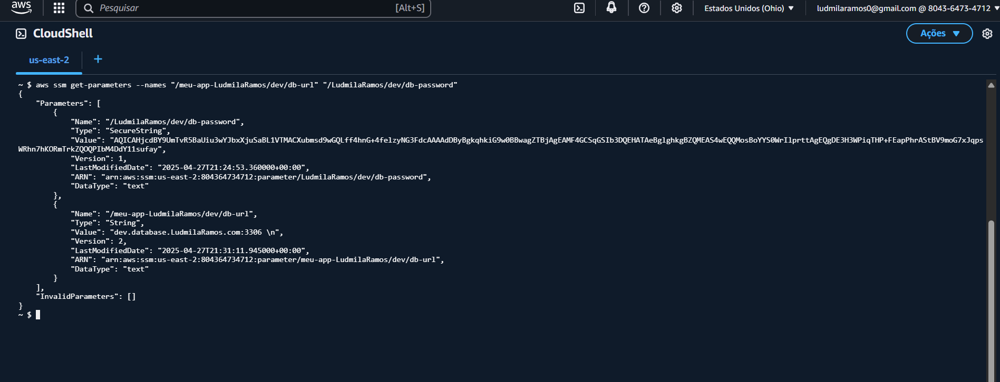

# Lab08 - AWS Systems Manager Parameter Store Hands-on (CLI)

## Descrição
Neste laboratório prático, aprendi a criar e gerenciar parâmetros utilizando o AWS Systems Manager Parameter Store, incluindo parâmetros seguros criptografados com chaves do KMS (AWS Key Management Service). Também explorei como acessar os valores desses parâmetros por meio da AWS CLI no CloudShell.

## Passos para Conclusão do Laboratório
- Criar parâmetros do tipo String e SecureString no Parameter Store.
- Criar uma chave de criptografia (CMK) no KMS para proteger os parâmetros sensíveis.
- Recuperar os parâmetros por meio da AWS CLI, utilizando comandos com e sem a opção de descriptografia.
- Navegar e visualizar os parâmetros diretamente no console do AWS Systems Manager.

## Objetivos
- Criar parâmetros do tipo String e SecureString no Parameter Store.
- Criar uma chave de criptografia no KMS.
- Recuperar parâmetros utilizando a AWS CLI, com e sem descriptografia.
- Navegar pelos principais recursos do AWS Systems Manager com confiança.

## Cenário
Criar e gerenciar configurações e segredos de uma aplicação, como URLs de banco de dados e senhas, de forma segura utilizando o AWS Systems Manager Parameter Store. A proteção dos parâmetros sensíveis será feita com chaves de criptografia gerenciadas pelo AWS KMS. O acesso aos parâmetros será realizado via AWS CLI no CloudShell.

## Prints
- 
- 
- 

---

## Conclusão
O laboratório proporcionou um entendimento prático sobre o uso do AWS Systems Manager Parameter Store para armazenar e proteger configurações e segredos de aplicações. A integração com o AWS KMS para criptografia assegura a segurança dos dados sensíveis, enquanto o acesso via AWS CLI no CloudShell oferece uma forma ágil e segura de recuperar essas informações durante o desenvolvimento e operação das aplicações.
