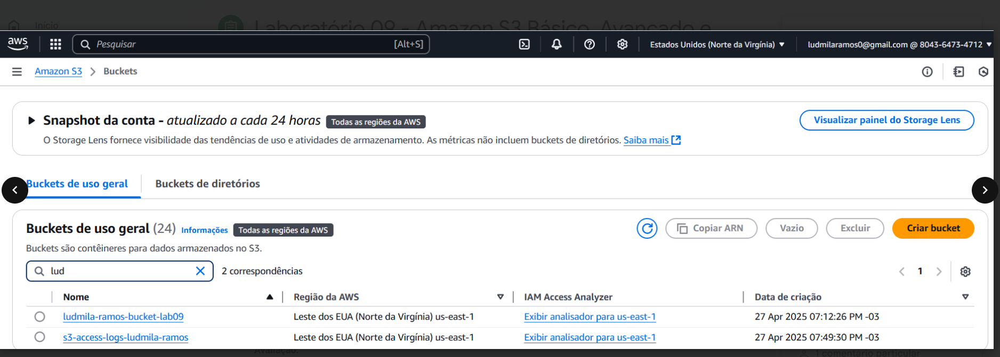
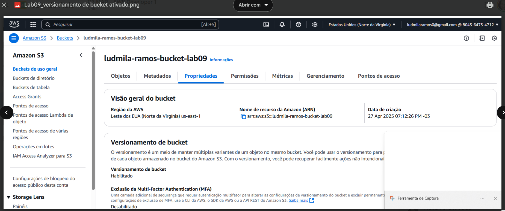
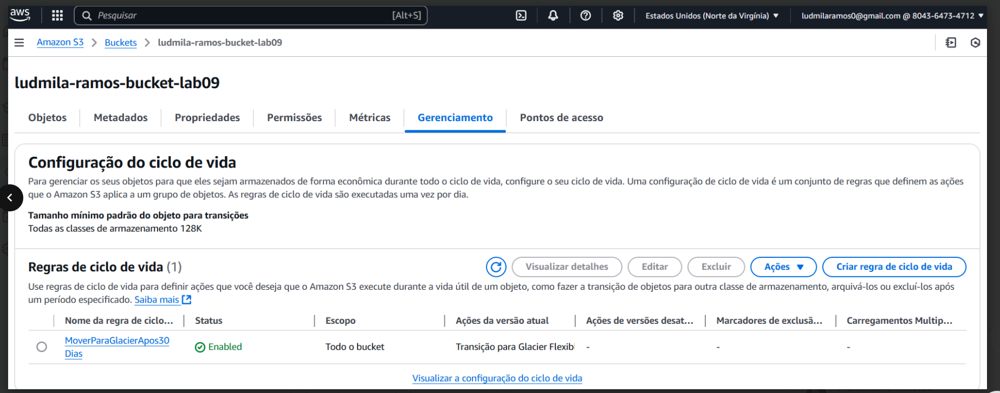
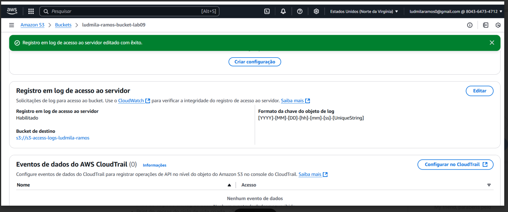

# Lab09 - Amazon S3 Básico, Avançado e Acesso a Logs

## Descrição
Neste laboratório prático, aprendi a utilizar os principais recursos do Amazon S3 voltados à organização, segurança e gerenciamento eficiente de dados. Foram abordadas práticas recomendadas para criação de buckets com configurações seguras, controle de versões de arquivos, automação de regras de ciclo de vida e geração de URLs pré-assinadas para compartilhamento temporário e seguro de objetos. Também foi demonstrada a ativação e configuração do servidor de logs de acesso, utilizando um segundo bucket dedicado ao armazenamento dos registros de operação.

## Passos para Conclusão do Laboratório
- Criar buckets no Amazon S3 com configurações recomendadas de segurança.
- Ativar e utilizar o versionamento para manter múltiplas versões de arquivos.
- Configurar regras de ciclo de vida para transição e expiração de objetos.
- Gerar URLs pré-assinadas para compartilhamento seguro e temporário de arquivos.
- Ativar e consultar logs de acesso utilizando um segundo bucket.

## Objetivos
- Criar buckets no Amazon S3 com configurações recomendadas de segurança.
- Ativar e utilizar o versionamento para manter múltiplas versões de arquivos.
- Configurar regras de ciclo de vida para transição e expiração de objetos.
- Gerar URLs pré-assinadas para compartilhamento seguro e temporário de arquivos.
- Ativar e consultar logs de acesso utilizando um segundo bucket.

## Cenário
Gerenciar o armazenamento na nuvem da empresa de forma organizada, segura e com custos otimizados, utilizando o Amazon S3. Aplicar práticas recomendadas como versionamento de objetos, automação de regras de ciclo de vida, monitoramento de acessos e geração de URLs pré-assinadas para compartilhamento seguro.

## Prints

### Criação de Buckets

### Controle de Versões

### Configuração de Regras de Ciclo de Vida

### Ativação e Consulta de Logs de Acesso

## Conclusão
O laboratório proporcionou um entendimento prático sobre o uso do Amazon S3 para gerenciamento seguro e eficiente de dados. A criação de buckets com configurações recomendadas, o versionamento de objetos e a automação por meio de regras de ciclo de vida permitem uma gestão otimizada do armazenamento. A geração de URLs pré-
